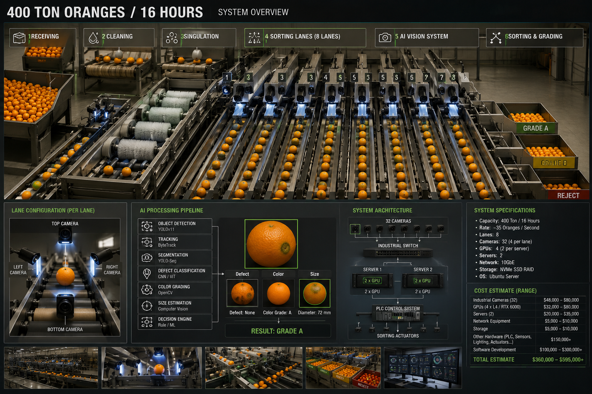
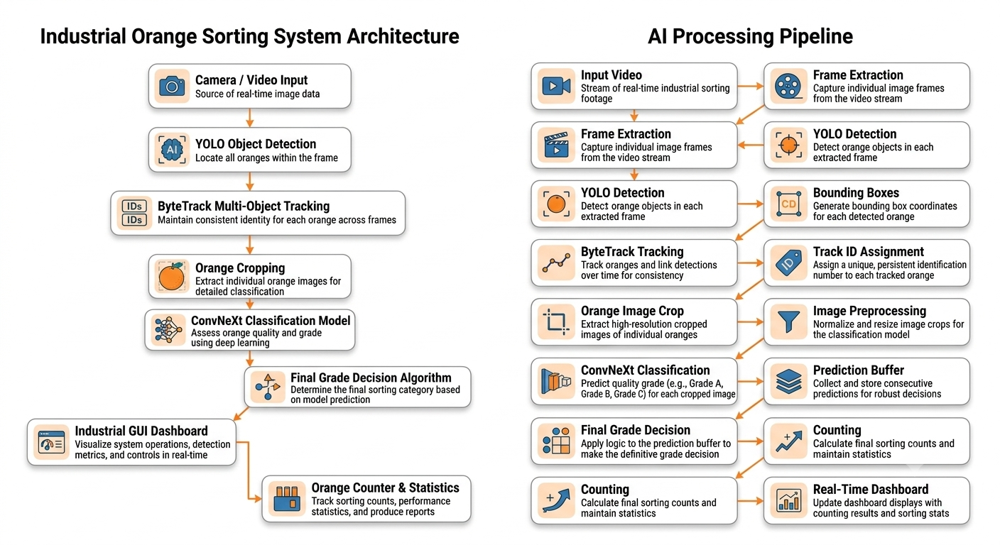
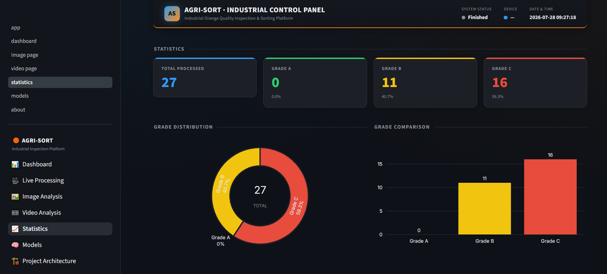
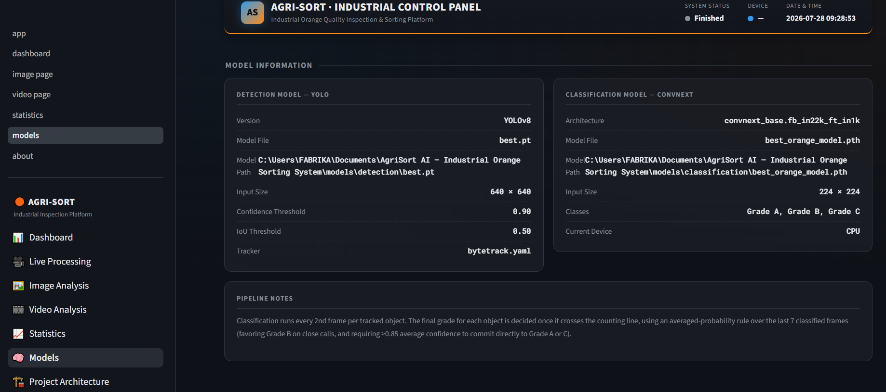
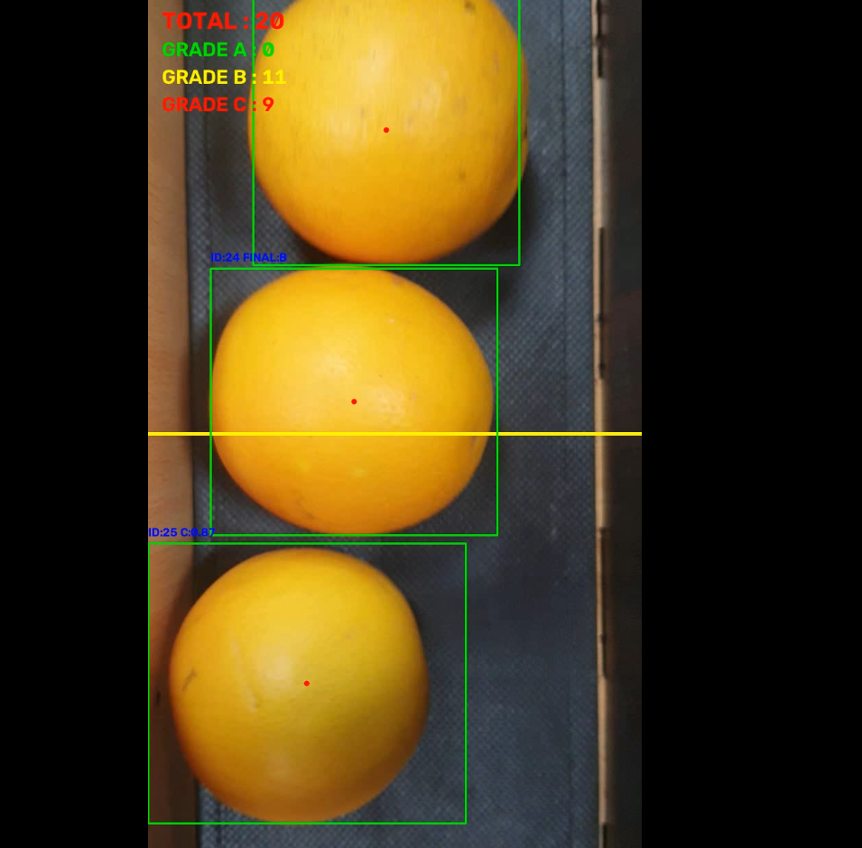
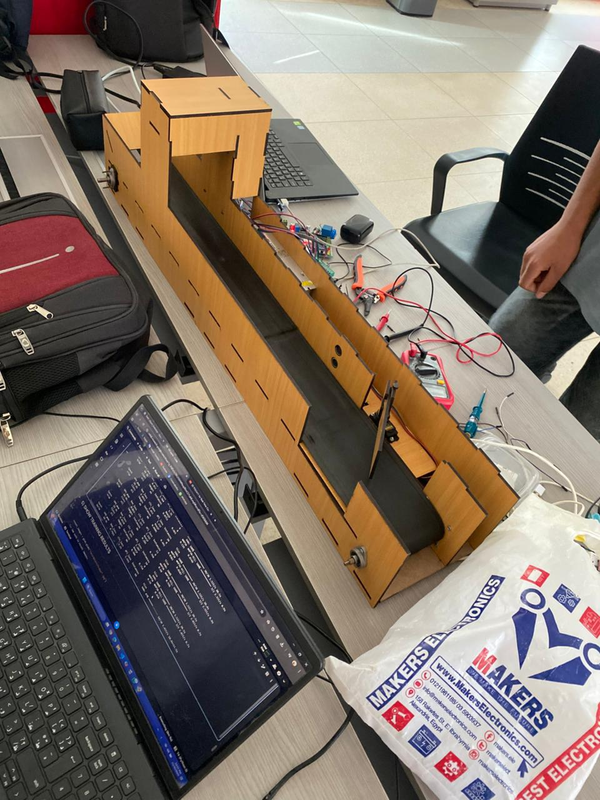

<div align="center">

# 🍊 AGRI-SORT AI – Industrial Orange Sorting System

### End-to-End Industrial AI Platform for Real-Time Orange Detection, Tracking, Classification, Analytics, and Browser-Based Monitoring

<p align="center">

</p>

---

<p align="center">


</p>

</div>

---

# 🍊 Overview

**AGRI-SORT AI** is an end-to-end Industrial Artificial Intelligence platform designed to automate orange quality inspection and grading using Computer Vision and Deep Learning.

Unlike standalone AI models, AGRI-SORT combines **real-time object detection, multi-object tracking, deep learning-based quality classification, intelligent decision-making, industrial visualization, and hardware integration** into a complete production-ready inspection system.

The project demonstrates how AI can be deployed in industrial environments to replace manual fruit grading with an accurate, scalable, and automated workflow.

---

# 🌐 Web Dashboard

The project now includes a modern **Streamlit-based Industrial Dashboard** that enables users to monitor and operate the AI pipeline directly from a web browser.

### Available Interfaces

| Interface | Status |
|-----------|--------|
| 🌐 Streamlit Industrial Dashboard | ✅ Current Version |
| 🖥 Desktop Application (PySide6) | Legacy Version |

The web dashboard provides:

- Live Industrial Monitoring
- Image Analysis
- Video Analysis
- Real-Time Statistics
- Industrial KPI Dashboard
- Browser-Based Deployment
- Responsive User Interface

---

# 🎯 Problem Statement

Traditional fruit grading still relies heavily on manual inspection, leading to several industrial challenges:

- Human errors
- Inconsistent grading quality
- High labor costs
- Slow processing speed
- Production bottlenecks
- Limited scalability
- Difficulty maintaining consistent export quality

Modern production lines require intelligent automation capable of inspecting products continuously with high speed, accuracy, and reliability.

---

# 💡 Solution

AGRI-SORT AI automates the complete orange grading workflow using Artificial Intelligence.

The platform performs:

- 🍊 Real-Time Orange Detection
- 🛰 Multi-Object Tracking
- 🧠 Deep Learning Quality Classification
- 🎯 Intelligent Grade Decision
- 📊 Automatic Counting
- 📈 Live Production Statistics
- 🖥 Industrial Monitoring Dashboard
- ⚙ Hardware Prototype Integration

The AI pipeline has been successfully integrated with a physical industrial prototype, demonstrating the feasibility of deploying Computer Vision systems in real production environments.

---

# ⭐ Key Features

## 🤖 Artificial Intelligence

- Real-Time YOLO Object Detection
- ByteTrack Multi-Object Tracking
- ConvNeXt Quality Classification
- Intelligent Grade Decision Logic
- Multi-frame Prediction Buffer
- Automatic Orange Counting

---

## 🌐 Industrial Dashboard

- Browser-Based Streamlit Dashboard
- Live Camera Processing
- Video Upload & Analysis
- Image Inspection
- Live Production Statistics
- Industrial KPI Cards
- Grade Distribution Charts
- Responsive Interface

---

## 🏭 Industrial Automation

- Hardware Prototype Integration
- Industrial Workflow Simulation
- Production-Oriented Architecture
- SCADA-Inspired Dashboard Design
- Modular Software Architecture
- Real-Time Monitoring

---

# 🏗️ System Architecture

<p align="center">

</p>

The system follows a modular architecture where each stage of the AI pipeline is isolated into independent components.

This architecture improves:

- Maintainability
- Scalability
- Modularity
- Deployment Flexibility
- Production Readiness

The same AI backend powers both the desktop application and the Streamlit web dashboard, ensuring consistent inference behavior across different user interfaces.

---

# 🔄 AI Processing Pipeline

<p align="center">

</p>

```

Video / Camera

        │

        ▼

YOLO Object Detection

        │

        ▼

ByteTrack Multi-Object Tracking

        │

        ▼

Orange Crop Extraction

        │

        ▼

Image Preprocessing

        │

        ▼

ConvNeXt Classification

        │

        ▼

Prediction Buffer

        │

        ▼

Intelligent Grade Decision

        │

        ▼

Orange Counting

        │

        ▼

Industrial Dashboard

```

The complete pipeline performs real-time quality inspection while maintaining high accuracy and stable object identities across video frames.

---
# 🤖 Industrial Hardware Prototype

One of the major achievements of AGRI-SORT AI is the successful deployment of the AI pipeline on a physical industrial prototype.

The prototype demonstrates the practical application of Artificial Intelligence in industrial quality inspection by integrating computer vision algorithms with real hardware components.

### Prototype Capabilities

- 📷 Camera-Based Inspection
- 🤖 AI Model Deployment
- 🍊 Automatic Orange Detection
- 🛰 Real-Time Object Tracking
- 🧠 Deep Learning Quality Classification
- 🎯 Intelligent Grade Assignment
- 📊 Automatic Counting
- ⚙ Hardware–Software Communication
- 🏭 End-to-End Industrial Workflow

The prototype validates the feasibility of replacing manual grading with an intelligent automated inspection system.

---

# 🎥 Demonstrations

## 🌐 Streamlit Web Dashboard

The project now includes a modern browser-based dashboard built with Streamlit.

The dashboard supports:

- Live Dashboard
- Image Analysis
- Video Analysis
- Production Statistics
- Industrial KPI Monitoring
- Interactive Charts

---

## 🖥 Desktop Application

The desktop application was originally developed using **PySide6** and shares the exact same AI backend.

Features include:

- Live Camera Processing
- Video Processing
- Detection Visualization
- Grade Counters
- Industrial Monitoring Interface

---

## 🤖 Hardware Prototype Demo

The physical prototype demonstrates:

- Real-Time Orange Detection
- ByteTrack Object Tracking
- ConvNeXt Classification
- Automatic Grade Assignment
- Industrial Automation Workflow

📹 **Prototype Video**

```
assets/demo/prototype_demo.mp4
```

---

## 🎥 Software Demonstration

📹 **Desktop Demo**

```
assets/demo/orange_counter_output.mp4
```

---

# 🖥 Industrial Monitoring Dashboard

The Streamlit dashboard provides an industrial monitoring experience inspired by SCADA/HMI systems.

### Dashboard Features

- Live Video Monitoring
- Image Inspection
- Video Upload
- Real-Time Detection
- Object Tracking IDs
- Orange Classification
- Grade Visualization
- Automatic Counting
- Processing Statistics
- Interactive Charts
- Responsive Browser Interface

---

## 📷 System Preview

## 🌐 Streamlit Industrial Dashboard

<p align="center">

</p>

The browser-based industrial dashboard provides real-time monitoring of the complete AI inspection pipeline, including production statistics, grade distribution, and system status.

---

## 🏭 Industrial Monitoring Interface

<p align="center">

</p>

A professional SCADA-inspired interface designed for industrial environments, offering an intuitive monitoring experience for operators and engineers.

---

## 🎯 Detection & Tracking Results

<p align="center">

</p>

Real-time orange detection, object tracking, classification, and intelligent grading using the integrated AI pipeline.

---

## 🤖 Hardware Prototype

<p align="center">

</p>

The physical prototype demonstrates the successful integration of Computer Vision, Artificial Intelligence, and industrial automation into a real-world orange sorting system.


---

# 🛠 Technologies Used

| Category | Technology |
|-----------|------------|
| Programming Language | Python |
| Deep Learning | PyTorch |
| Computer Vision | OpenCV |
| Object Detection | YOLOv8 |
| Object Tracking | ByteTrack |
| Classification | ConvNeXt |
| Web Dashboard | Streamlit |
| Desktop GUI | PySide6 (Legacy) |
| Data Visualization | Plotly |
| Numerical Computing | NumPy |
| Image Processing | Pillow |
| Deep Learning Utilities | TorchVision |

---

# 📂 Project Structure

```text
AGRI-SORT-AI
│
├── assets
│   ├── demo
│   └── screenshots
│
├── docs
│   ├── architecture.png
│   ├── ai_pipeline.png
│   └── system_design.md
│
├── models
│   ├── classification
│   │   └── best_orange_model.pth
│   └── detection
│       └── best.pt
│
├── notebooks
│   ├── classification_training.ipynb
│   └── detection_training.ipynb
│
├── backend
├── components
├── pages
├── styles
├── utils
│
├── app.py
├── config.py
├── requirements.txt
├── runtime.txt
├── packages.txt
├── README.md
├── LICENSE
└── .gitignore
```

---

# ⚙ Installation

Clone the repository

```bash
git clone https://github.com/FatmaEissa/Industrial-Orange-Sorting-System.git
```

Move into the project directory

```bash
cd Industrial-Orange-Sorting-System
```

Create a virtual environment

```bash
python -m venv .venv
```

Activate it

**Windows**

```bash
.venv\Scripts\activate
```

**Linux / macOS**

```bash
source .venv/bin/activate
```

Install the required dependencies

```bash
pip install -r requirements.txt
```

---

# 🚀 Running the Application

Launch the Streamlit dashboard

```bash
streamlit run app.py
```

Open your browser

```
http://localhost:8501
```

The application automatically loads:

- YOLO Detection Model
- ConvNeXt Classification Model
- ByteTrack Tracker
- Industrial Dashboard
- Statistics Engine

---

# 📋 Usage

### Image Analysis

1. Open **Image Analysis**
2. Upload an orange image
3. The system performs detection and quality classification
4. View predictions instantly

---

### Video Analysis

1. Open **Video Analysis**
2. Upload a video
3. Start processing
4. Monitor detection in real time
5. Download the processed output

---

### Live Processing

1. Open **Live Dashboard**
2. Select a camera or video source
3. Monitor oranges in real time
4. View counters and live statistics
5. Stop processing at any time

---
# 🧠 AI Models

AGRI-SORT AI combines multiple state-of-the-art Deep Learning models to achieve robust, real-time industrial inspection.

| Model | Purpose |
|--------|----------|
| **YOLOv8** | Real-Time Orange Detection |
| **ByteTrack** | Multi-Object Tracking |
| **ConvNeXt** | Orange Quality Classification |

The combination of these models enables reliable object detection, identity preservation, and quality grading within a unified industrial AI pipeline.

---

# ⚙ AI System Components

## 🎯 Detection Module

The detection module is responsible for locating oranges in every incoming frame.

### Responsibilities

- Detect oranges in real time
- Generate bounding boxes
- Support multiple objects simultaneously
- High-speed inference using YOLOv8
- Industrial-ready detection pipeline

---

## 🛰 Tracking Module

After detection, every orange is assigned a unique Track ID.

The tracking system ensures:

- Stable object identities
- Smooth tracking across frames
- Prevention of duplicate counting
- Accurate movement analysis

ByteTrack enables reliable tracking even under temporary occlusions and crowded scenes.

---

## 🍊 Classification Module

Each detected orange is cropped and passed to the ConvNeXt classification model.

The classifier predicts one of three quality grades:

- 🟢 Grade A
- 🟡 Grade B
- 🔴 Grade C

Instead of relying on a single prediction, AGRI-SORT continuously evaluates each tracked orange across multiple frames.

---

## 🧠 Intelligent Grade Decision

A confidence-based decision strategy is used to improve robustness.

Rather than selecting the prediction from a single frame, the system:

- Collects prediction probabilities across multiple frames
- Maintains a prediction history for each tracked orange
- Computes the final quality grade using an intelligent decision function
- Reduces temporary classification noise
- Produces more stable industrial results

This approach significantly improves grading consistency in real production environments.

---

## 📊 Counting Module

When an orange crosses the virtual counting line:

- The final grade is confirmed
- The Track ID is finalized
- Production counters are updated
- Dashboard statistics refresh automatically

Counters include:

- Total Oranges
- Grade A
- Grade B
- Grade C

---

# 📈 Performance

The AI pipeline was evaluated using validation datasets collected during project development.

## Classification Performance

| Metric | Value |
|---------|-------|
| Accuracy | **98%** |
| Weighted F1-Score | **0.98** |
| Classes | 3 |
| Inference | Real-Time |

The complete system was successfully tested on:

- Recorded industrial videos
- Live camera streams
- Hardware prototype deployment

---

# ☁ Streamlit Deployment

The Streamlit dashboard enables browser-based access to the complete AI pipeline without requiring the desktop application.

Deployment steps:

1. Push the repository to GitHub.
2. Open Streamlit Community Cloud.
3. Create a new application.
4. Select:

```
Repository
Branch
Main file: app.py
```

5. Deploy.

The platform automatically installs all dependencies from:

- requirements.txt
- packages.txt
- runtime.txt

---

# 🧩 Model Files

Place the trained model weights inside:

```text
models/
├── detection/
│   └── best.pt
│
└── classification/
    └── best_orange_model.pth
```

The application automatically loads the models during startup.

---

# ⚡ Hardware Acceleration

The application automatically detects the available hardware.

If CUDA is available:

- GPU inference is enabled automatically.

Otherwise:

- CPU inference is used.

This allows AGRI-SORT AI to run both on local workstations and Streamlit Community Cloud without modifying the code.

---

# 🔬 Training

Training notebooks are included in the repository.

```text
notebooks/
├── classification_training.ipynb
└── detection_training.ipynb
```

These notebooks include:

- Dataset preparation
- Data augmentation
- Model training
- Validation
- Performance evaluation

---

# 🌱 Future Improvements

Planned future enhancements include:

- Multi-camera industrial support
- Defect segmentation
- Fruit size estimation
- Fruit weight estimation
- Support for additional fruit types
- Cloud-based production monitoring
- Edge AI optimization
- Production analytics dashboard
- Automatic report generation
- REST API integration
- MLOps pipeline
- Docker deployment
- Kubernetes support
- Model Registry
- Continuous Model Training

---

# 💼 Applications

AGRI-SORT AI can be applied in:

- Citrus Packing Houses
- Food Processing Factories
- Agricultural Export Facilities
- Smart Manufacturing
- Industrial Quality Inspection
- Computer Vision Research
- AI Automation Projects

---
# 🤝 Contributing

Contributions are always welcome!

If you would like to improve AGRI-SORT AI, feel free to:

1. Fork the repository.
2. Create a feature branch.

```bash
git checkout -b feature/your-feature
```

3. Commit your changes.

```bash
git commit -m "Add new feature"
```

4. Push your branch.

```bash
git push origin feature/your-feature
```

5. Open a Pull Request.

Whether it's fixing bugs, improving documentation, optimizing models, or adding new features, every contribution is appreciated.

---

# 🛣 Roadmap

The long-term vision of AGRI-SORT AI includes:

### Phase 1 (Completed)

- ✅ Orange Detection
- ✅ Multi-Object Tracking
- ✅ ConvNeXt Classification
- ✅ Intelligent Grade Decision
- ✅ Automatic Counting
- ✅ Industrial Hardware Prototype
- ✅ Desktop Application
- ✅ Streamlit Web Dashboard

---

### Phase 2

- Cloud Deployment
- REST API
- Production Analytics
- User Authentication
- Database Integration

---

### Phase 3

- Multi-Camera Monitoring
- Multi-Fruit Classification
- Defect Segmentation
- Edge AI Deployment
- Docker Containers
- Kubernetes Deployment
- MLOps Pipeline
- Continuous Model Training

---

# 📚 References

This project is built using several outstanding open-source technologies.

- PyTorch
- Ultralytics YOLO
- ByteTrack
- OpenCV
- Streamlit
- Plotly
- NumPy
- TorchVision
- TIMM

Special thanks to the open-source community for providing the tools that made this project possible.

---

# 👩‍💻 Author

## Fatma Eissa

**AI & Machine Learning Engineer**

Passionate about building intelligent systems that bridge the gap between Artificial Intelligence and Industrial Automation.

### Areas of Interest

- Computer Vision
- Deep Learning
- Machine Learning
- Industrial AI
- Intelligent Automation
- MLOps
- Edge AI
- AI System Design

---

# 🌐 Connect With Me

### GitHub

https://github.com/FatmaEissa

### LinkedIn

https://linkedin.com/in/fatmaeiissa

### Kaggle

https://www.kaggle.com/fatmaeissa

---

# 🏆 Project Highlights

✔ End-to-End Industrial AI Platform

✔ Browser-Based Monitoring Dashboard

✔ Desktop Industrial Application

✔ Real-Time Object Detection

✔ Multi-Object Tracking

✔ Deep Learning Classification

✔ Intelligent Decision Logic

✔ Industrial Hardware Prototype

✔ Production-Oriented Software Architecture

✔ Streamlit Cloud Deployment

---

# 🙏 Acknowledgments

This project represents months of research, experimentation, model training, hardware integration, and software engineering.

Special thanks to everyone who contributed to testing, evaluating, and improving this system.

The project combines:

- Artificial Intelligence
- Computer Vision
- Deep Learning
- Industrial Automation
- Modern Web Technologies

to demonstrate how AI can be integrated into real-world industrial environments.

---

# 📄 License

This project is licensed under the **MIT License**.

See the **LICENSE** file for complete licensing information.

---

# ⭐ Support the Project

If you found this repository useful, consider:

⭐ Starring the repository

🍴 Forking the project

🛠 Contributing improvements

📢 Sharing it with others

Your support helps the project grow and reach more developers and researchers.

---

<div align="center">

# 🍊 AGRI-SORT AI

### Intelligent Industrial Orange Sorting Platform

**Built with ❤️ using Computer Vision, Deep Learning, and Industrial AI**

---

⭐ **If you like this project, don't forget to leave a Star!**

Thank you for visiting this repository.

</div>