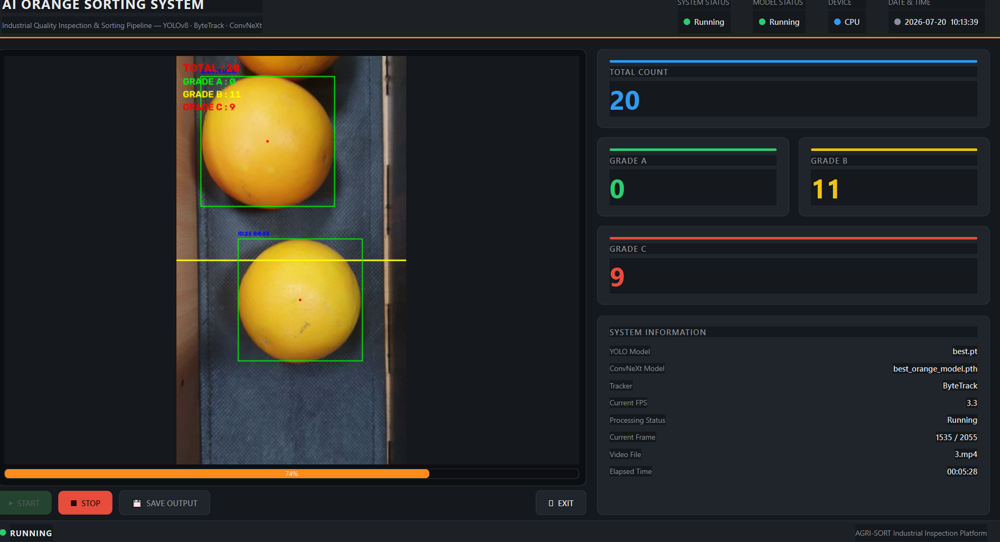
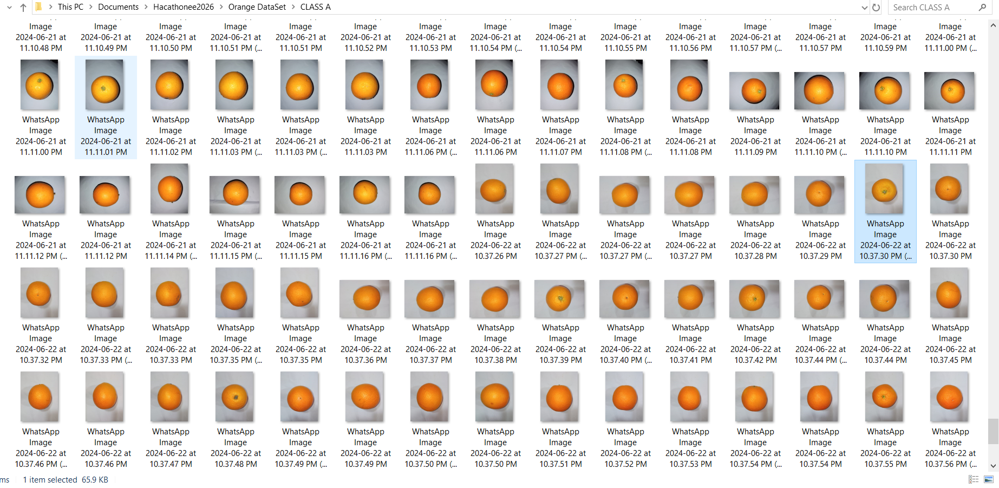
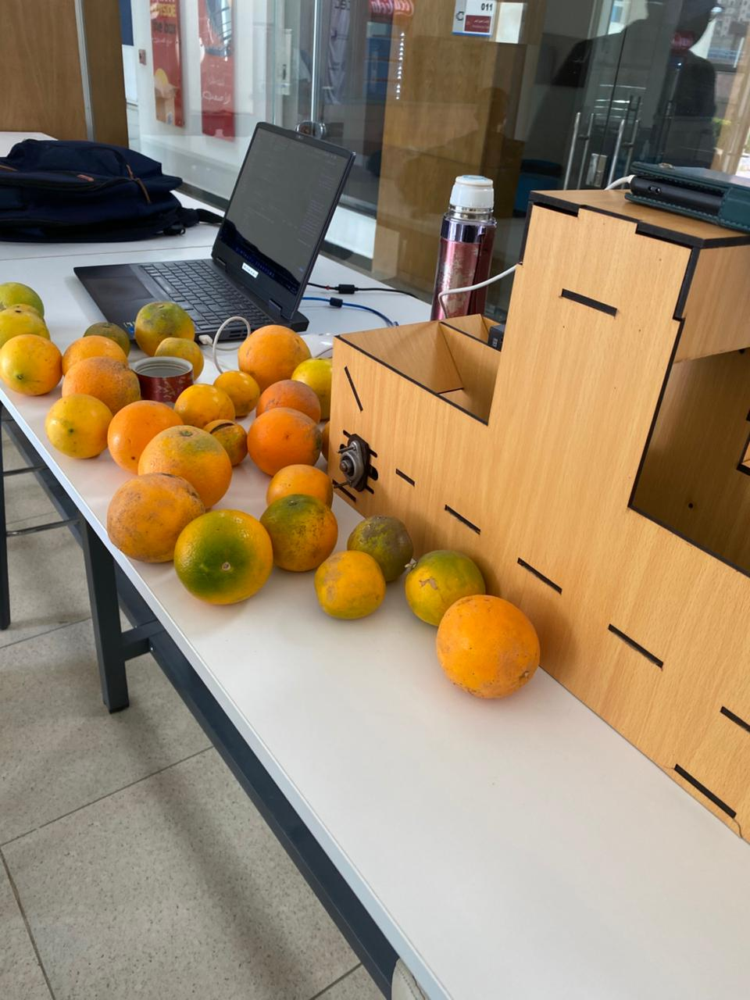

<div align="center">

# 🍊 Industrial AI Orange Sorting System

### AI-Powered Computer Vision System for Real-Time Orange Detection, Tracking, Classification, and Industrial Automation

<p align="center">


</p>

</div>

---

# 📌 Overview

The **Industrial AI Orange Sorting System** is an end-to-end Computer Vision solution designed to automate orange grading on industrial production lines.

The system combines **real-time object detection, multi-object tracking, deep learning-based quality classification, and industrial hardware integration** to accurately detect, classify, grade, and count oranges while displaying the results through an industrial graphical dashboard.

Unlike standalone AI models, this project represents a complete intelligent inspection system that integrates software and hardware into a functional industrial prototype.

---

# 🎯 Problem Statement

Manual fruit grading suffers from several limitations:

- Human errors
- Inconsistent grading
- High labor cost
- Slow processing speed
- Difficulty maintaining production quality

Modern production lines require intelligent automation capable of performing real-time quality inspection with high accuracy and consistency.

---

# 💡 Solution

This project automates the complete orange sorting workflow using Artificial Intelligence.

The system:

- Detects oranges in real time
- Tracks every orange individually
- Classifies orange quality
- Assigns the final grade
- Counts processed oranges
- Displays live statistics
- Supports industrial deployment

The AI model was successfully integrated with a physical hardware prototype, demonstrating the feasibility of deploying computer vision in industrial environments.

---

# ⭐ Key Features

- Real-Time Orange Detection
- Multi-Object Tracking
- Deep Learning Classification
- Intelligent Grade Decision
- Automatic Orange Counting
- Industrial Dashboard (SCADA Style)
- Live Camera Support
- Video Processing Support
- Hardware Prototype Integration
- Modular AI Architecture
- Production-Oriented Design

---

# 🏗️ System Architecture

<p align="center">

</p>

The system follows a modular pipeline that separates detection, tracking, classification, decision-making, and visualization, making it scalable and easy to maintain.

---

# 🔄 AI Processing Pipeline

<p align="center">

</p>

Pipeline Overview

```
Video / Camera

↓

YOLO Object Detection

↓

ByteTrack Multi-Object Tracking

↓

Orange Crop Extraction

↓

Image Preprocessing

↓

ConvNeXt Classification

↓

Prediction Buffer

↓

Final Grade Decision

↓

Orange Counting

↓

Industrial Dashboard
```

---

# 🤖 Hardware Prototype

One of the major contributions of this project is the successful integration of the AI system with a physical prototype.

The deployed prototype demonstrates:

- AI model deployment
- Camera-based inspection
- Real-time object detection
- Automatic grading
- Live counting
- Hardware-software communication
- End-to-end industrial workflow

This validates the practicality of using AI for industrial fruit sorting applications.

---
# 🎥 Demonstration

## Hardware Prototype Demo

This video demonstrates the complete AI-powered industrial orange sorting system running on the physical prototype.

The prototype showcases:

- Real-time orange detection
- Multi-object tracking
- Deep learning-based quality classification
- Automatic grading
- Real-time counting
- AI and hardware integration

📹 **Prototype Demonstration**

[prototype_demo.mp4](assets/demo/prototype_demo.mp4)

---

## Software Demonstration

This demo shows the desktop application processing oranges using the complete AI pipeline.

📹 **Dashboard Demonstration**

[orange_counter_output.mp4](assets/demo/orange_counter_output.mp4)

# 🖥️ Industrial Dashboard

The graphical interface provides:

- Live camera stream
- Video upload
- Real-time detection
- Object tracking IDs
- Orange classification
- Grade visualization
- Orange counters
- Processing statistics
- Industrial monitoring interface

---

# 📷 Screenshots

## Dashboard

<p align="center">

</p>

---

## Detection

<p align="center">

</p>

---

## Dataset

<p align="center">

</p>

---

## Hardware Prototype

<p align="center">

</p>

<p align="center">

</p>

---

# 🎥 Demo

A demonstration video of the complete system is available inside:

```
assets/demo/
```

---

# 🛠️ Technologies Used

| Category | Technologies |
|-----------|--------------|
| Programming Language | Python |
| Computer Vision | OpenCV |
| Deep Learning | PyTorch |
| Object Detection | YOLO |
| Object Tracking | ByteTrack |
| Classification | ConvNeXt |
| GUI | PySide6 |
| Numerical Computing | NumPy |
| Deep Learning Utilities | TorchVision |

---

# 📂 Project Structure

```
Industrial-Orange-Sorting-System
│
├── assets
│   ├── demo
│   └── screenshots
│
├── docs
│   ├── architecture.png
│   ├── ai_pipeline.png
│   └── system_design.md
│
├── models
│   ├── classification
│   └── detection
│
├── notebooks
│   ├── classification_training.ipynb
│   └── detection_training.ipynb
│
├── src
│   ├── gui.py
│   ├── main.py
│   └── processing.py
│
├── requirements.txt
├── README.md
└── LICENSE
```

---

# ⚙️ Installation

Clone the repository

```bash
git clone https://github.com/FatmaEissa/Industrial-Orange-Sorting-System.git
```

Go to the project directory

```bash
cd Industrial-Orange-Sorting-System
```

Install dependencies

```bash
pip install -r requirements.txt
```

Run the application

```bash
python src/main.py
```

---

# 🚀 Usage

Launch the application:

```bash
python src/main.py
```

### Workflow

1. Launch the Industrial Dashboard.
2. Select **Live Camera** or upload a recorded video.
3. The system automatically performs:
   - Orange Detection
   - Multi-Object Tracking
   - Orange Classification
   - Grade Decision
   - Automatic Counting
4. Monitor the results through the real-time dashboard.

---

# 🧠 AI Models

The system combines multiple state-of-the-art deep learning models to achieve reliable real-time performance.

| Model | Purpose |
|--------|----------|
| YOLO | Real-time orange detection |
| ByteTrack | Multi-object tracking |
| ConvNeXt | Orange quality classification |

---

# ⚙️ System Components

### 🎯 Detection Module

- Detects oranges in every frame.
- Generates bounding boxes.
- Supports multiple objects simultaneously.
- Optimized for real-time inference.

---

### 🛰️ Tracking Module

- Assigns a unique Track ID to every orange.
- Maintains object identity across frames.
- Prevents duplicate counting.

---

### 🍊 Classification Module

Each detected orange is cropped and passed to the ConvNeXt classification model.

The model predicts one of three quality grades:

- Grade A
- Grade B
- Grade C

---

### 🧠 Grade Decision Module

Instead of relying on a single prediction, the system stores predictions across multiple frames.

The final grade is determined using a confidence-based decision strategy, improving robustness and reducing classification noise.

---

### 📊 Counting Module

When an orange crosses the counting line:

- Final grade is confirmed.
- Orange counter is updated.
- Dashboard statistics are refreshed in real time.

---

# 📈 Performance

The classification model achieved high validation performance during testing.

| Metric | Value |
|---------|-------|
| Accuracy | 98% |
| Weighted F1-Score | 0.98 |
| Inference | Real-Time |

The complete pipeline was successfully tested on both recorded videos and a live camera feed.

---

# 🏭 Industrial Prototype

A physical prototype was developed to validate the complete AI pipeline in an industrial environment.

The prototype integrates:

- Camera-based inspection
- AI inference
- Hardware communication
- Real-time grading
- Automatic counting
- Industrial dashboard

This demonstrates the feasibility of deploying AI-powered quality inspection systems in real production environments.

---

# 🔬 Training

Training notebooks are included in the repository.

```
notebooks/
├── classification_training.ipynb
└── detection_training.ipynb
```

The repository also includes the trained model weights used for inference.

---

# 🌱 Future Improvements

Potential future enhancements include:

- Multi-camera support
- Defect segmentation
- Support for additional fruit types
- Cloud-based monitoring dashboard
- Edge AI optimization
- Production analytics dashboard
- Automated report generation
- MLOps pipeline for continuous deployment

---

# 🤝 Contributing

Contributions are welcome.

If you would like to improve the project:

1. Fork the repository.
2. Create a new branch.
3. Commit your changes.
4. Open a Pull Request.

---

# 👩‍💻 Author

## Fatma Eissa

**AI & Machine Learning Engineer**

Specializing in:

- Computer Vision
- Deep Learning
- Industrial AI
- Intelligent Automation

### Connect with me

- LinkedIn: https://linkedin.com/in/fatmaeiissa
- Kaggle: https://www.kaggle.com/fatmaeissa
- GitHub: https://github.com/FatmaEissa

---

# 🙏 Acknowledgments

Special thanks to everyone who contributed to the development, testing, and evaluation of this project.

This work represents the combination of Artificial Intelligence, Computer Vision, and Industrial Automation to build a practical end-to-end intelligent inspection system.

---

# 📄 License

This project is licensed under the MIT License.

See the **LICENSE** file for more information.

---

<div align="center">

## ⭐ If you found this project useful, consider giving it a star!

**Thank you for visiting this repository.**

</div>